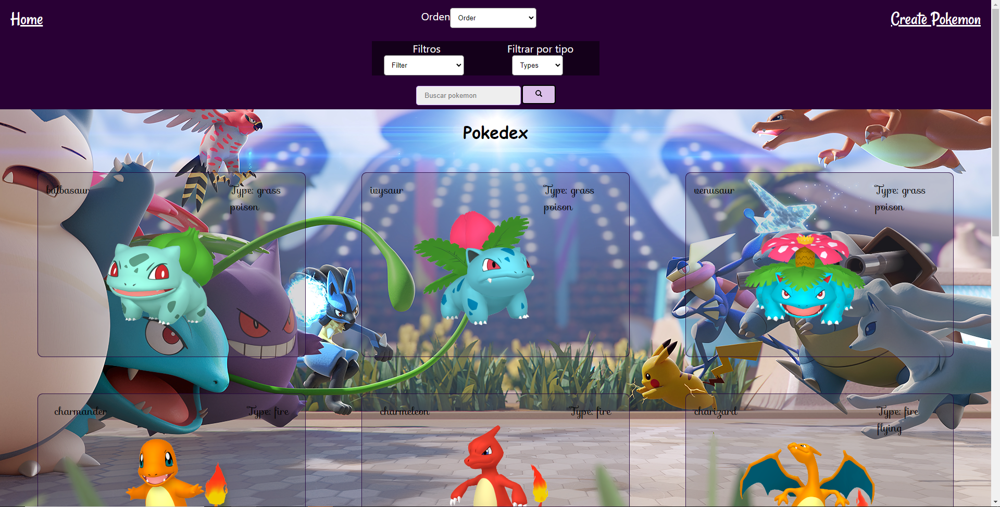
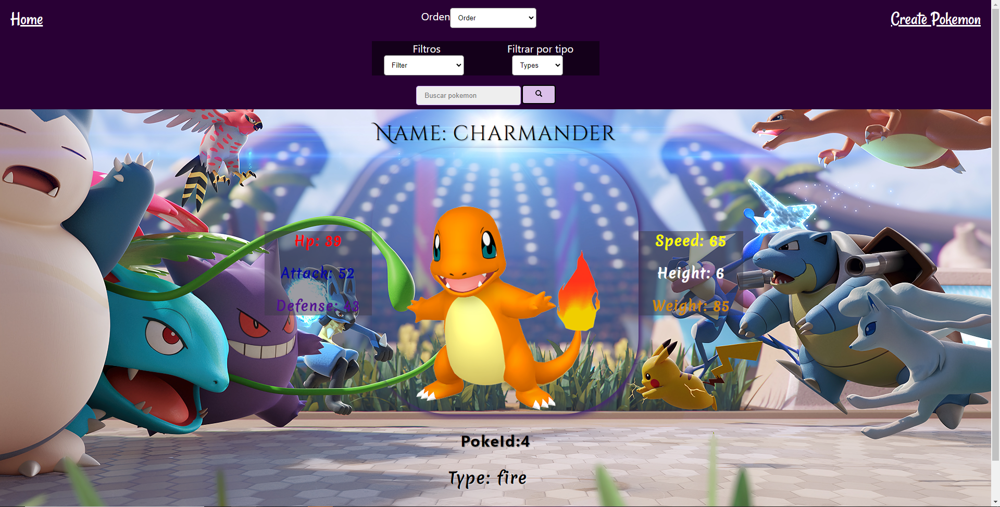
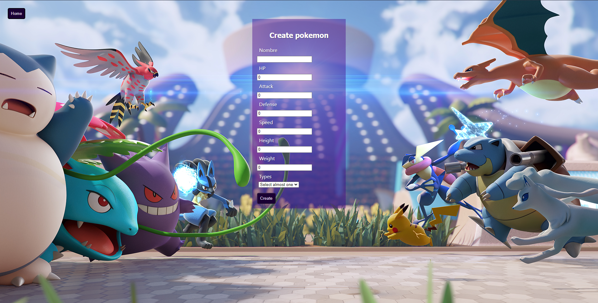

<p align='left'>
    
</p>

# Individual Project - Henry Pokemon

<p align="left">
  
</p>

Landing Page: En la landin page se cuenta con una imagen de fondo y con un botón el cual nos da ingreso a la página. Comienza tu aventura!!!

<p align="center">
  
</p>

Home: En home podemos encontrar una navBar, que nos permite ordenar, filtrar, buscar o dirigirnos hacia el creador de pokemon. Además se pueden ver las tarjetas de los pokémon.

<p align="center">
  
</p>

Detail: En detail se cuenta con la imagen del pokémon y a su alrededor todas su estadísiticas, como así también su tipo y ID.

<p align="center">
  
</p>

Form: En form podremos crear un pokémon a nuestro gusto.

<p align="center">
  
</p>

### Quick Start 

1. Fork the repository to have a copy of it in your accounts
2. Clone the repository on your computers to start working


Currently the required versions are:

 * __Node__: 12.18.3 or older
 * __NPM__: 6.14.16 or older

In `api` create a file called: `.env` that has the following form:

```
DB_USER=usuariodepostgres
DB_PASSWORD=passwordDePostgres
DB_HOST=localhost
```

Replace `postgresuser` and `postgrespassword` with your own credentials to connect to postgres

Additionally, it will be necessary to create a database called `pokemon` from psql

* Run the next commands in file root:

* npm install

* npm start

* Open http://localhost:3000 in your browser

The `client` content was created using: Create React App.


#### Credits:
- React
- Redux
- Express
- Sequelize - Postgres